# Network Security
## Building a Decentralized E-voting System using Blockchain

The COVID19 pandemic has reignited a debate about the use of e-voting systems
with detractors citing security concerns as the primary reason why they are against
these systems. With the rapid development of technology, however, it is possible
that in the near future, public perceptions around e-voting will inevitably change. A
blockchain is a growing list of records which are linked using cryptography. Each
block contains a cryptographic hash of the previous block, a timestamp, and
transaction data. Blockchain has gained increasing popularity in recent years as a
result of being a keystone of popular cryptocurrencies. The fact that this
technology is decentralized and secure also makes it a perfect candidate for e-voting
applications. 
## 
In this project, a stand-alone proof of concept blockchain evoting
system is delivered. The system provides a decentralised architecture to run and support
a voting scheme that is open, fair, and independently verifiable. 

Requirements:

- [Truffle Ganache](https://trufflesuite.com/ganache/)
- [Node JS](https://nodejs.org/en/download)
- [MailTrap](https://mailtrap.io/signin)

CSS and HTML of the system was adapted from: [Repo](https://github.com/dhruti-patel/BlockVote-Truffle)

## Steps to run project ([inside this directory](./Code/)):

<br>
To install truffle:

```
npm install truffle -g
```

<br>
To install required packages and / modules:

```
npm install
```
<br>

Before deploying system make sure to sign with [MailTrap](https://mailtrap.io/signin) to setup the mail testing. After signing up, head to the email testing portal as shown below:


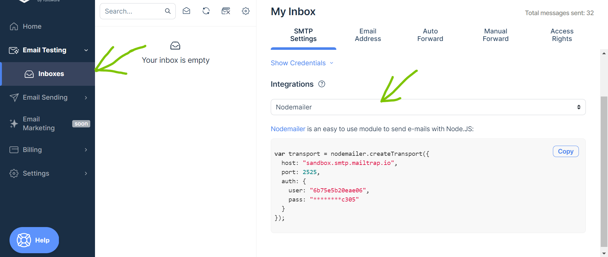

You will have to create an inbox to receive your messages. Select the integration to be Nodemailer and click on "show credentails" to get your credentials for the API. [Update this file with your credentials](./Code/routes/registeration.js).


Also ensure to add the [Truffle Ganache](https://trufflesuite.com/ganache/) network to metamask.
To deploy smart contact (must be done while Truffle Ganache is opened):

```
npx truffle migrate 
```
<br>
if "npx truffle migrate" gives an error, try removing "npx".
To run the web app


 ```
 npm run dev
 ```

 The first address on your [Truffle Ganache](https://trufflesuite.com/ganache/) interface as shown below(your addresses will be different) is the vote administrator, and is the only one that can log into the admin interface.

 .png)


 Once the system is deployed, it should look like this:

  
 
 
 use the wallet of the administrator to login into the admin interface:

 

 The admin interface should look like:

  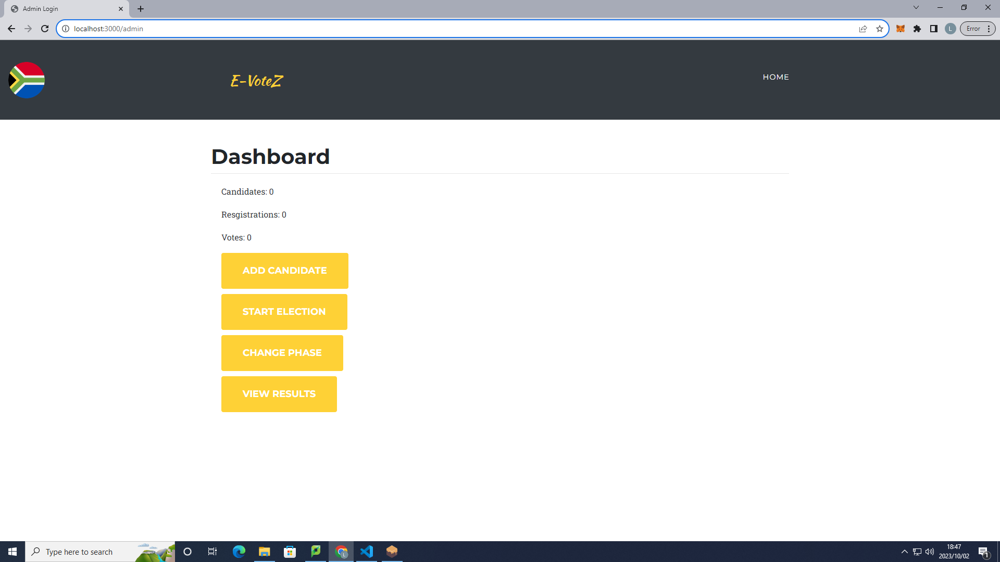

  From here, you begin adding candidates or starting an election. The election starts in the registration phase. From there, you can change the phase from registration to voting to results. Do note that the smart contract code is set up such that:

  - A minimum of two candidates have to be added by the admin to allow the admin to change the election phase to voting.
  - The number of registered users should be > than the number of candidates, e.g., 2 candidates, 3 voters.
  - The admin can only add candidates before starting an election and during registration.

  In registration, the other accounts in [Truffle Ganache](https://trufflesuite.com/ganache/) can be used as the voter wallets.

  To register, go to registration view:
  - For test purposes, use the commented test IDs in [app.js](./Code/src/js/app.js). Note each ID can only be used once to simulate real voting. Each wallet address can only be used once.

  - Fill in the details and submit, a OTP form should pop up (OTP is sent to the [MailTrap](https://mailtrap.io/signin) inbox you created). Fill out the form using the OTP to complete registration.

  
 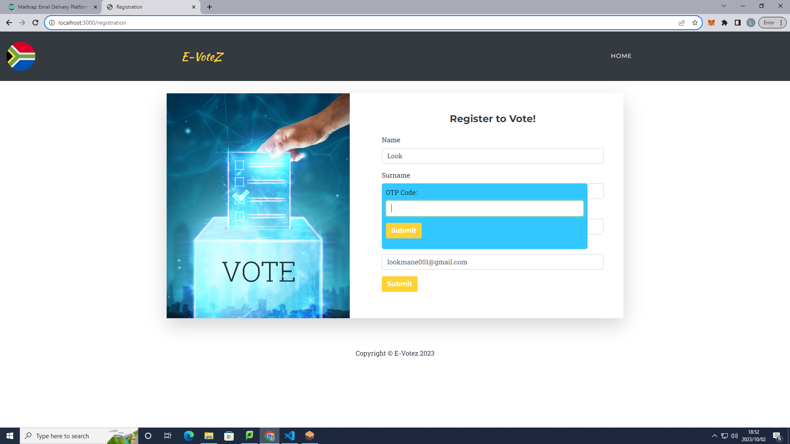

 OTP in [MailTrap](https://mailtrap.io/signin):


 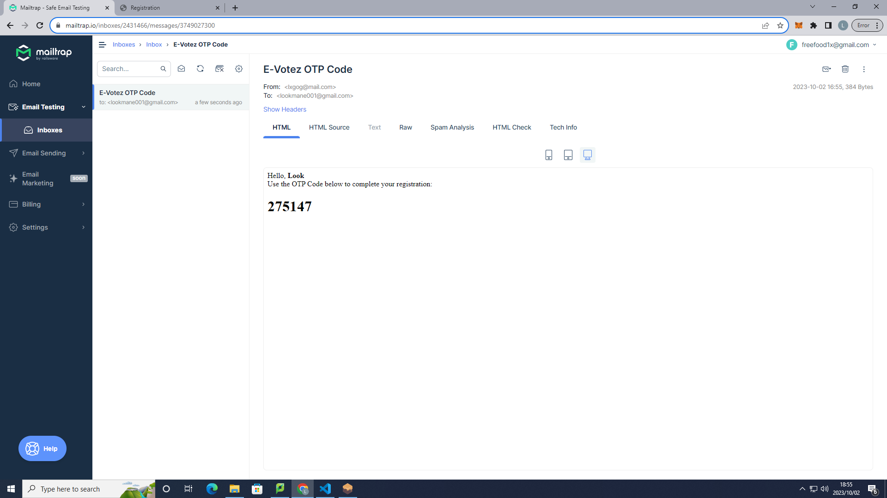


After registering, head over to the profile view to see your profile:

   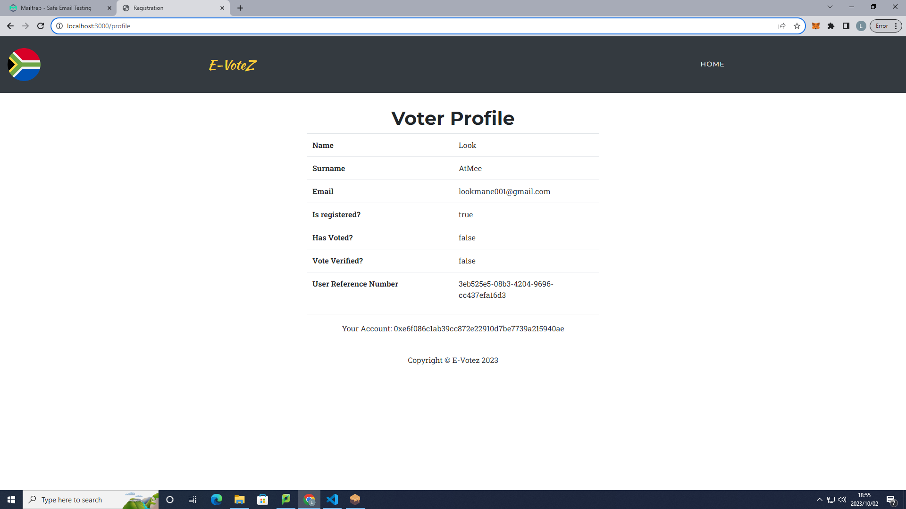


  When the admin (first address in [Truffle Ganache](https://trufflesuite.com/ganache/)) changes the phase to voting, voters can cast their votes in the votes view. Preliminary results can be viewed by going to "/results" on the home page.

Voting portal (voter selects preferred candidate and smart contract is called for interaction):

   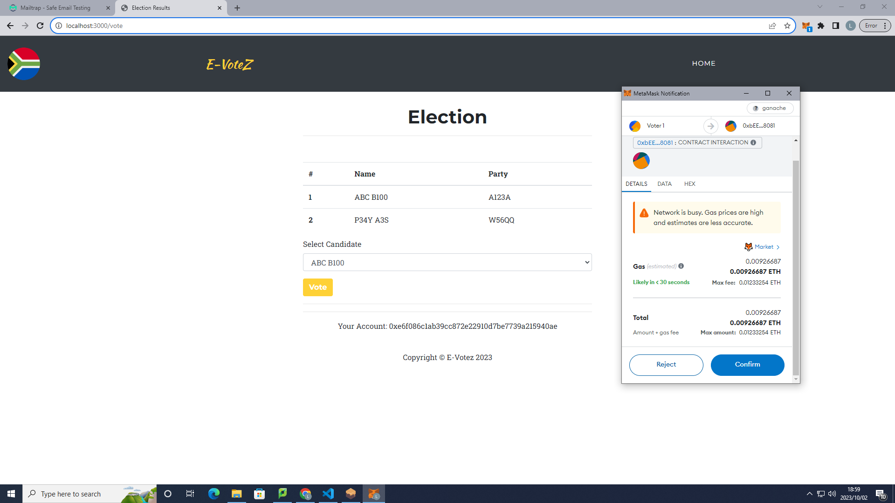

After voting, each voter receives two ECC (Elliptic Curve Cryptography) public keys, which can be viewed in their profile portal (as shown below). These keys will be used to audit votes in the results phase.

 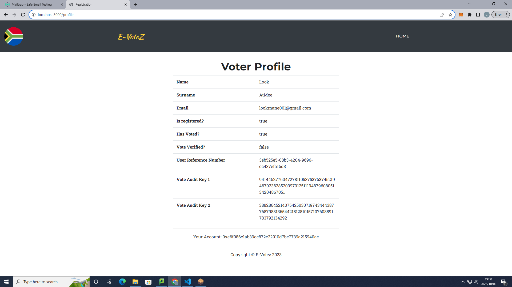


When admin changes the phase to results, no voters will be able to cast votes anymore. Head to the results portal to see the results and audit trail:

 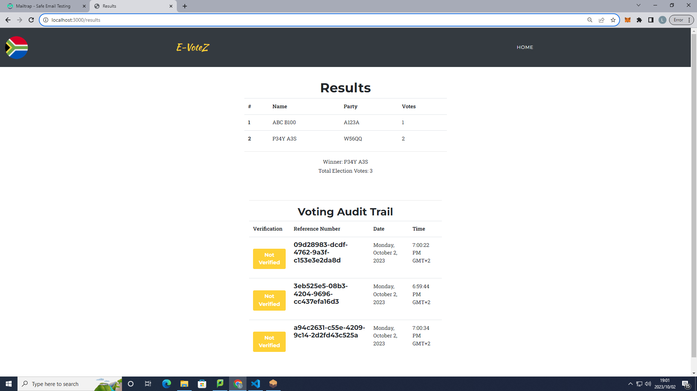

The audit trail shown above is not verified. This is where the audit keys come in. In the home page, a new option called "verify-your-vote" should appear. When this option is clicked, it should take you to this form:

  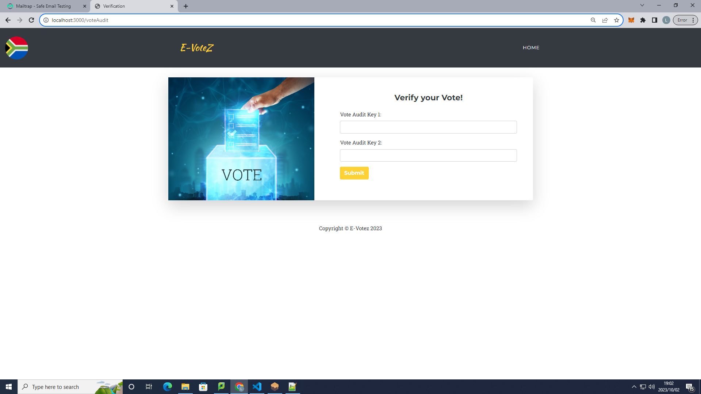

Each voter can use their audit keys to verify their votes:

   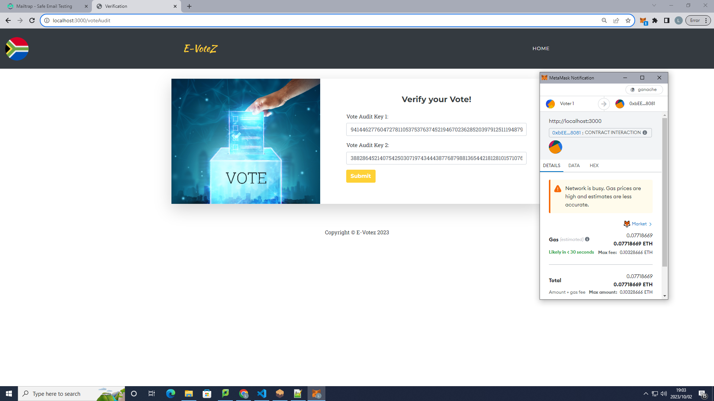

After verifying, your profile will say true for vote verification, and the verification stamp for your vote will turn green in the audit tail.

The vote turned green after being verified:

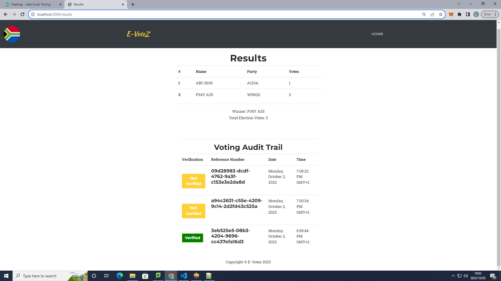


The voter is verified:

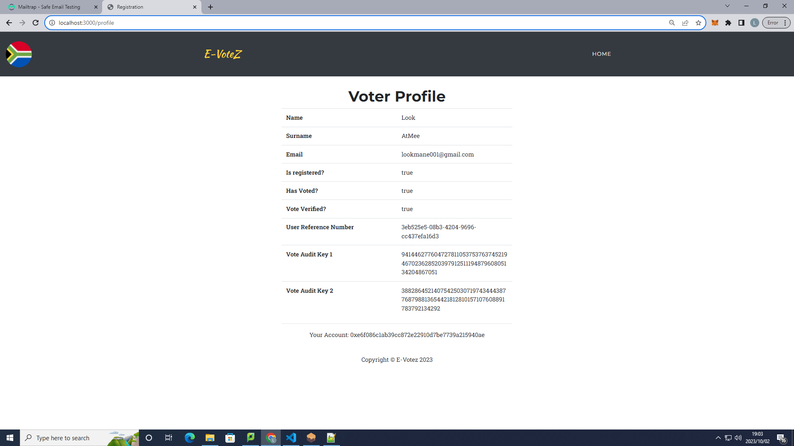


The audit trail is a way of allowing public verification of votes to uphold integrity, while not compromising the identity of a voter to provide confidentiality (motivated by CIA Triad).

